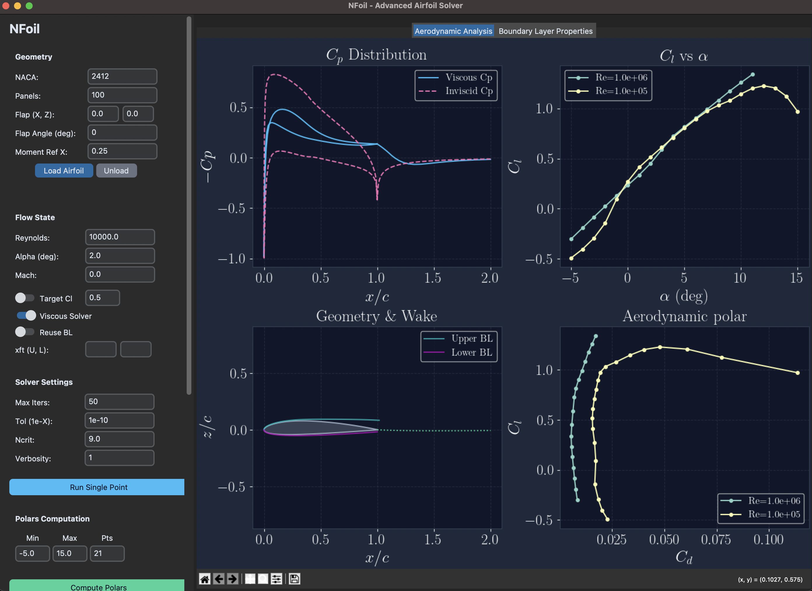
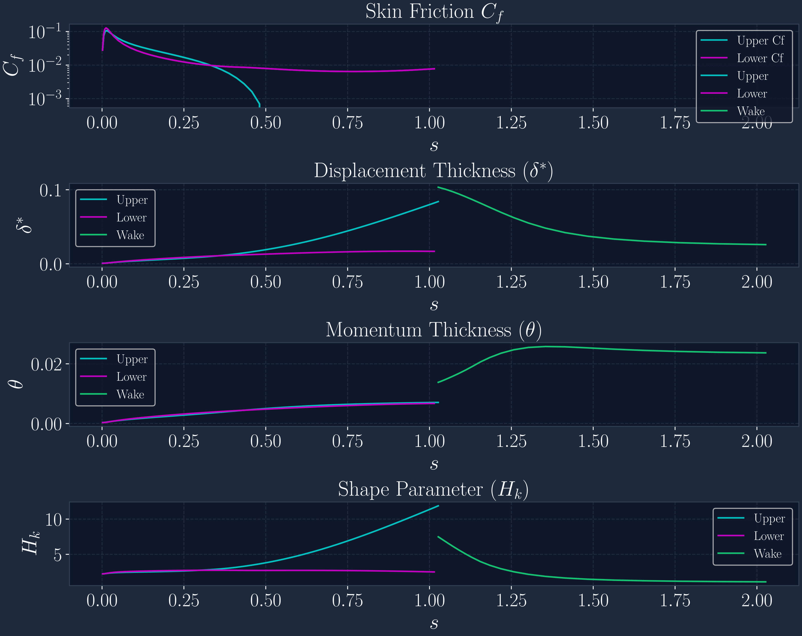
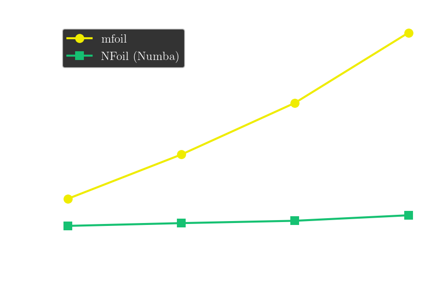

# NFoil

**High-performance subsonic airfoil analysis with Numba JIT acceleration.**

NFoil is a fork of [mfoil](https://websites.umich.edu/~kfid/codes.html#mfoil) by Krzysztof J. Fidkowski, rewritten with Numba JIT compilation for **~18x faster** subsonic airfoil analysis. It retains full numerical compatibility with the original while dramatically reducing solve times with the addition of a Graphical User Interface (GUI).





> _Developed and optimized by Cayetano Martínez-Muriel with assistance from Google Antigravity. Based on the original mfoil by Krzysztof J. Fidkowski, which uses mostly the same physical models as XFOIL, with some modifications._

---

## Performance

Complete alpha sweep benchmark (NACA 2412, 16 angles, $Re=10^6$):

| Panels | Original (s) | NFoil (s) | Speedup |
|--------|-------------|--------------|---------|
| 100    | 26.5        | **1.4**      | **18.8x** |
| 200    | 67.7        | **4.0**      | **17.0x** |
| 300    | 115.6       | **6.1**      | **18.8x** |
| 400    | 180.8       | **11.3**     | **16.0x** |

Both versions share the same algorithmic complexity of $\approx O(N^{1.35})$. The speedup comes entirely from eliminating Python/SciPy overhead via JIT compilation and dense array operations.

> _Results obtained after running both versions in the command line on a M1-Max MacBook Pro. Using the GUI will likely result in slower performance due to the overhead of the GUI._



---

##  Interactive GUI

NFoil includes a full-featured GUI (`gui.py`) built with CustomTkinter:

- **Real-time analysis**: Single-point solve with live Cp distribution, airfoil geometry (with physical BL thickness $\delta$), and aerodynamic coefficients.
- **Robust polar computations**: Multi-$\alpha$ sweep with automatic continuation past non-converged points. If a point fails, the solver retries with a cold BL restart; if it still fails, it skips that point and continues the sweep. All computed cases from multiple runs are stored with descriptive labels (NACA/$Re$/$\alpha$/$M$) in a persistent dropdown. It is possible to overlay polars from multiple Reynolds numbers for comparison.
- **Target Cl (Inverse Mode)**: A dedicated toggle and input field to find the angle of attack for a specific lift coefficient ($C_L$), integrated into both single-point solves and polar sweeps.
- **Load/Unload Airfoil**: Directly load custom coordinates from `.dat` or `.txt` files (TE-to-TE, CCW/CW). Includes an "Unload" button to instantly revert to the parameterized NACA generator.
- **BL properties tab**: Skin friction (Cf), displacement thickness (δ*), momentum thickness (θ), and shape parameter (Hk) across upper, lower, and wake surfaces.
- **GPU flow fields** (optional): Real-time velocity/pressure contour maps via [Taichi Lang](https://www.taichi-lang.org/) (`taichi_fields.py`), leveraging Metal/CUDA (and other) GPUs.
- **ASCII export**: Cp curves, geometry, skin friction arrays, and polar data.

```bash
python gui.py
```

---

##  Main Changes from Original `mfoil`

### 1. Dense Array Assembly (Eliminating SciPy Sparse Overhead)

The #1 bottleneck in the original code was SciPy sparse matrix overhead inside the coupled Newton solver:

- **`build_glob_sys`**: Replaced `scipy.sparse.dok_matrix` allocation for `R_U` and `R_x` with dense `np.zeros` arrays. This eliminated ~70% of total runtime that was spent in DOK indexing, `_validate_indices`, `__setitem__`, and COO conversion.

- **`solve_glob`**: Replaced `scipy.sparse.lil_matrix` assembly + `scipy.sparse.linalg.spsolve` with dense `np.zeros` array + `np.linalg.solve`. Includes a `LinAlgError` fallback to `np.linalg.lstsq` for near-singular Jacobians at extreme operating conditions.

### 2. Numba JIT-Compiled Physics Kernels

All core boundary-layer functions have been rewritten as `@njit(cache=True, fastmath=True)` kernels. 

### 3. Vectorized Sensitivity Assembly

`calc_ue_m` (inviscid edge velocity sensitivity matrix) was rebuilt with parallelised Numba kernels:
- `build_B_bulk`: Vectorized source-panel influence coefficient assembly over all panels simultaneously, replacing an O($N^2$) Python loop.
- `build_Csig_bulk`: Vectorized wake source-influence assembly.

### 4. Robust Solver Improvements

- **Singular matrix fallback**: `solve_glob` catches `np.linalg.LinAlgError` and falls back to `np.linalg.lstsq` for near-singular Jacobians (common at very low Reynolds numbers or high angles of attack).

### 5.Flow Field Calculation

- **Velocity and pressure fields**: `taichi_fields.py` computes the velocity and pressure fields on a background grid using a Taichi Lang, rendering the flow field in real-time using the available GPU.

---

##  Dependencies

```
numpy
scipy
matplotlib
numba
customtkinter   # for GUI only
taichi           # optional, for GPU flow fields
```

##  Quick Start

```python
import nfoil as nf

# Create and solve
N = nf.nfoil(naca='2412', npanel=200)
N.setoper(alpha=5, Re=1e6, Ma=0.3)
N.solve()

# Results
print(f"Cl = {N.post.cl:.4f}")
print(f"Cd = {N.post.cd:.6f}")
print(f"Cm = {N.post.cm:.4f}")
```

##  License

MIT License — Copyright (C) 2026 Cayetano Martínez-Muriel. 

##  Acknowledgments

Many thanks to Krzysztof J. Fidkowski for his work on [mfoil](https://websites.umich.edu/~kfid/codes.html#mfoil). 

Thanks to the [Google Antigravity](https://antigravity.dev/) team for their tool.
